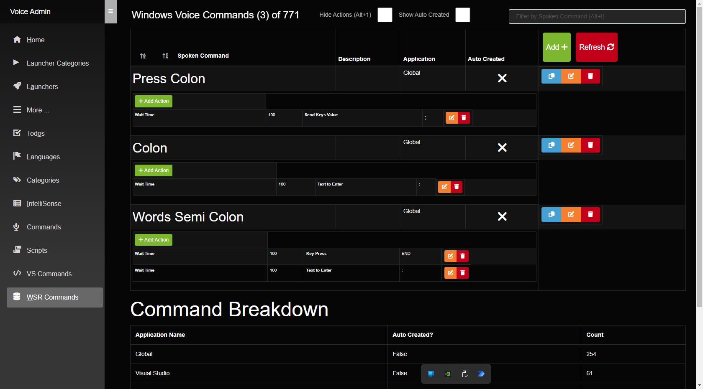
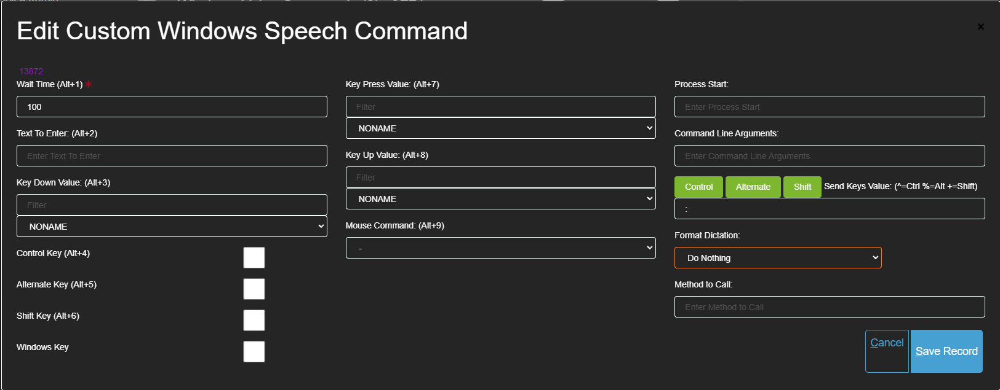
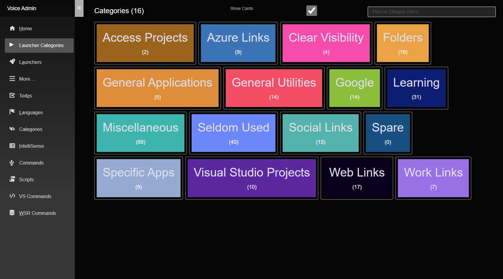
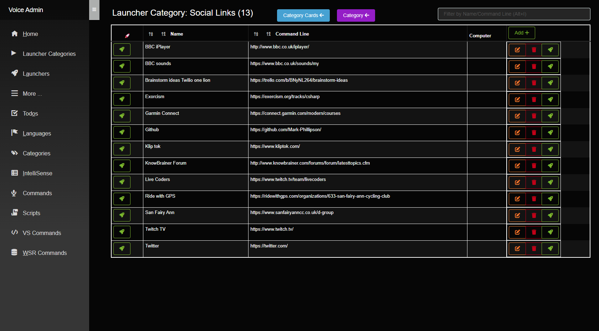
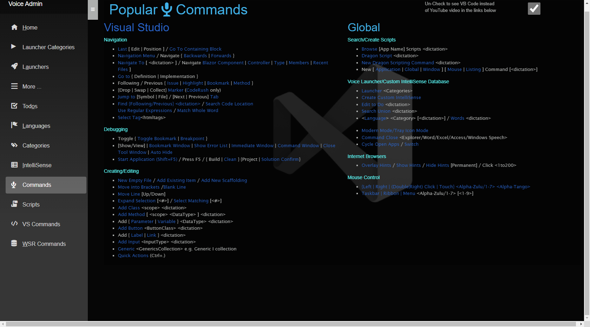
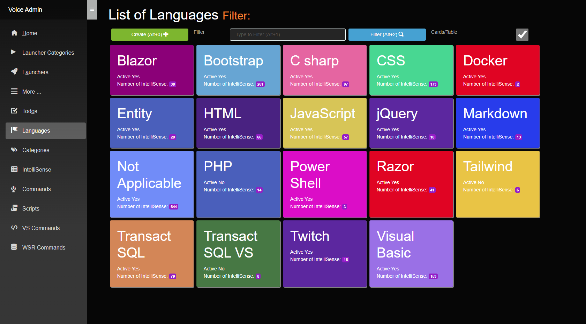

# Voice Admin

* This repo contains a Blazor server side application which includes a To Do section and provides the functionality to maintain some speech recognition related database tables. 

* The tables are used in conjunction with Microsoft Azure and a C# application to provide extra functionality when coding by voice, like Custom IntelliSense that can be called upon by voice from any application.

An example screenshot of commands follows:

* Also provided by the tables is the ability to launch any application, folder or website:

 Application also has a Popular Commands page that lists all the main commands to code with voice in Visual Studio and Visual Studio Code:

 

 * Custom intellisense is used to insert code at a specific location. It can be called by saying a language and a category or just searching a description:

 